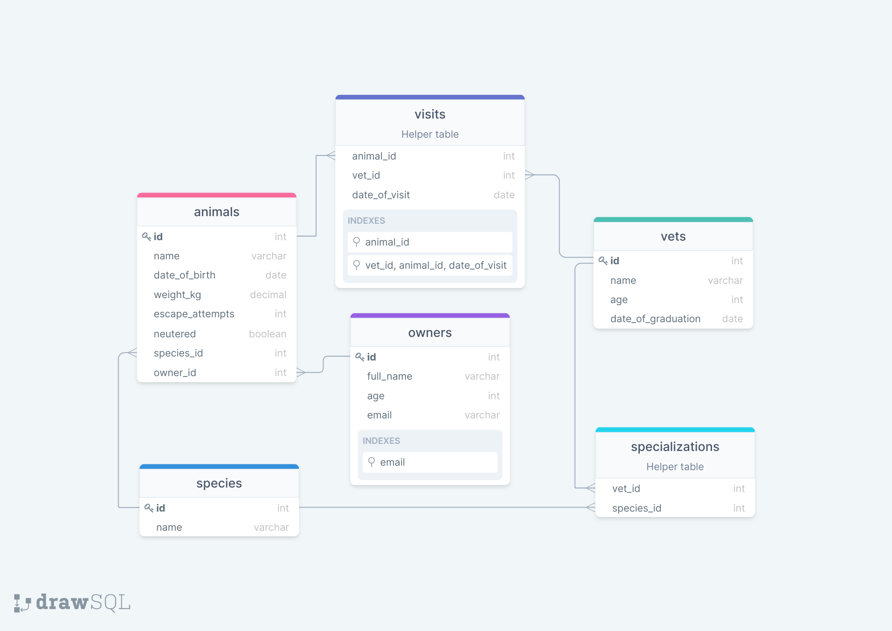

<h2>Vet Clinic Database</h2>

 

This repository includes files containing pure SQL commands for:

<ul>
  <li>Creating a new table within the vet_vlinic database. These commands can be found in the <a href="./schema.sql">schema.sql</a> file.</li>
  <li>Inserting new data into the table. These commands can be found in the <a href="./data.sql">data.sql</a> file.</li>
  <li>Checking the database for queries. These commands can be found in the <a href="./queries.sql">queries.sql</a> file.</li>
</ul>

 

## Database Schema

## Authors

👤 Anja Schmidt

GitHub: <a href="https://github.com/Anjacodes" rel="noopener noreferrer">@Anjacodes</a> 
Twitter: <a href="https://twitter.com/Anja_Schmidt7" rel="noopener noreferrer">@Anja_Schmidt7</a> 
LinkedIn: <a href="https://www.linkedin.com/in/anja-schmidt7/" rel="noopener noreferrer">Anja Schmidt</a> 

## 🤝 Contributing

Contributions, issues, and feature requests are welcome!

Feel free to check the [issues page](../../issues/).

## Show your support

Give a ⭐️ if you like this project!

## Acknowledgments

- Hat tip to anyone whose code was used
- Inspiration
- etc

## 📝 License

This project is [MIT](./MIT.md) licensed.

  

Copyright (c) 2022 Anja Schmidt